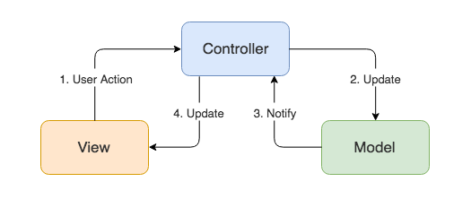
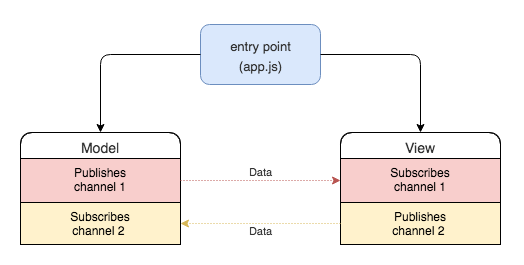
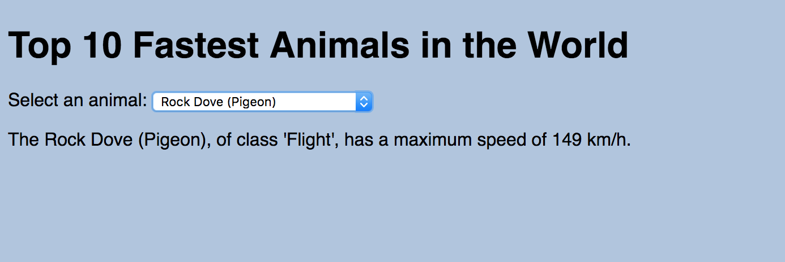
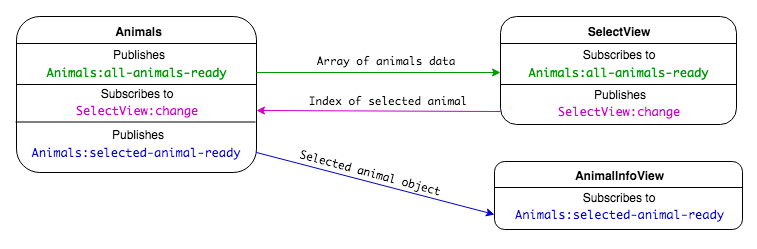

# Modular Front End

**Lesson Duration: 2 hours**

### Learning Objectives
- Understand the benefits of breaking up a front-end app into modules / components
- Be able to implement the Publish/Subscribe design pattern
- Be able to build a modular front end

## Intro

As programmers, we want to create well-structured applications so that they are maintainable and extensible. This is something that an architectural pattern can help us do. An architectural pattern informs our decision making around directory and file structure, and the responsibilities of the application's components.

In this lesson we are going to look at one pattern that we can use in our JavaScript applications, the publish-subscribe pattern (pub/sub).

### Design Patterns

One popular architectural design pattern we have used previously is Model-View-Controller (MVC). The MVC pattern allowed us to structure our applications and split the responsibilities into the following components:

- Models that are responsible for managing the application data
- Views that are responsible for the user interface
- Controllers that are responsible for defining a set of routes to handle incoming requests, pulling data from models, and passing it to views



*Diagram of MVC pattern where the controller receives requests via user interaction, handles communication with the model and updates the view*

The MVC pattern is useful when working with the traditional request-response cycle, where user interactions trigger requests to the server via a set of routes.

Dynamic JavaScript applications often only have one route that the browser uses to make an initial request, loading the HTML and other resources including the JavaScript files. The JavaScript is then used to handle the user interaction, dynamically updating what is rendered to the page in real-time. This replaces the traditional request-response cycle.

A JavaScript application with one route that dynamically renders the page's content is called a Single-Page-Application (SPA).

## The Publish-Subscribe Pattern

If we don't have controllers that are responsible for communicating between the views and models, listening for user interactions and responding with the relevant data, how can we prevent our models and views becoming tightly-coupled (where they are dependent on one another)? The publish-subscribe pattern (pub/sub) is a messaging pattern that allows us to publish data from one part of the application and receive it in another.

In order to understand the pub/sub pattern, let's use the analogy of a radio station and a radio. The radio station broadcasts its content on a certain channel. If you want to listen to the content, you tune your radio to that channel. The pub/sub pattern works just like this. Components can subscribe to a channel and wait for content to be published. Other components can then publish to that channel, sending data to the subscribers.



*Diagram of Pub/Sub pattern, where views and models communicate by publishing on and subscribing to channels*

The pub/sub pattern lets us write loosely coupled components because models and views publish on and subscribe to channels rather than being dependent on each other to communicate. This helps makes our application extensible and maintainable.

## Custom Events

We want our models and views to be able to publish data on channels to let the rest of the application know that something has happened. How can we do this? We will use [Custom Events](https://developer.mozilla.org/en-US/docs/Web/API/CustomEvent).

We have already been using events to send messages in our front-end JavaScript apps, but rather than using an element's predefined event (such as button's `click` event, or a form's `submit` event), we are going to create our own events using the web API's `CustomEvent`s to send data from one component to another.

1. Components can subscribe to a channel (listen for a custom event)
2. By subscribing, it waits for content to be published (for the event to be dispatched).
3. Other components can then publish to that channel, sending data to the subscribers (dispatch events with data attached).

### Creating a Custom Event

> Instructor note: hand out custom_events_start

Run the start point, installing the dependencies and running webpack:

```bash
npm install
npm run build
```
Open index.html in the browser, and check the console for a log confirming the JavaScript has loaded.

Before we create our own `CustomEvent` called `my-custom-event`, let's start by setting up a listener for it. When adding event listeners previously, we considered three pieces of information:

1. The element listening for the event, e.g. a button
2. The event we are listening for, e.g. 'click'
3. The callback function we want to execute once the event is dispatched, e.g. a function that displays some text on the page

We will follow exactly the same pattern when creating custom events:

1. The element listening for the event will be the `document` object.
2. The event we will be listening for is going to be `my-custom-event`. (Because it is a *custom* event, its name is defined by us.)
3. The callback function will be responsible for publishing the data on the custom event, `my-custom-event`.

Let's do that in app.js.

```js
// src/app.js

document.addEventListener("DOMContentLoaded", function(){
  document.addEventListener("my-custom-event", function(event){ // NEW
    console.log('event', event);
  });
});
```

Now that we've set up our event listener, we can create our first custom event (`my-custom-event`) and dispatch it.

```js
// src/app.js

document.addEventListener("DOMContentLoaded", function(){
  document.addEventListener("my-custom-event", function(event){
    console.log('event', event);
  });

  const event = new CustomEvent("my-custom-event"); // NEW
  document.dispatchEvent(event); // NEW
});
```

If you refresh your browser, you will see the event is being logged in the console. Have a look through the structure of the `CustomEvent` object. In particular, notice the `detail` property, which is currently `null`. This is the property on which we will send the data.

### Adding Data to Our Event

We have created and dispatched a custom event, but we haven't attached any data to it. As we want to use these custom events to pass data around our application, we need to know how to do that next.

Usually we would want to add useful data to be dispatched with the event, such as values from a submitted form or data received from a database. For now, let's add a `"Hello World!"` string. We do this by passing an object as the second argument to the `CustomEvent` constructor. The object must have a `detail` property, and the value will be the data that you want to send.

```js
// src/app.js

document.addEventListener("DOMContentLoaded", function(){
  // ...
  const event = new CustomEvent("my-custom-event", { // MODIFIED
    detail: "Hello World!" // NEW
  });
  document.dispatchEvent(event);
});
```

Now we can access the `event.detail` property inside the event listener to access the data.

```js
// src/app.js

document.addEventListener("DOMContentLoaded", function(){
  document.addEventListener("my-custom-event", function(event){
    console.log('event', event);
    console.log('event.detail', event.detail); // NEW
  });
  // ...
});
```

We can add any JavaScript value we want to the event, including arrays and objects.

```js
// src/app.js

document.addEventListener("DOMContentLoaded", function(){
  // ...
  const event = new CustomEvent("my-custom-event", {
    detail: { // MODIFIED
      name: "Caroline",
      age: 38
    }
  });
  document.dispatchEvent(event);
});
```

### Refactoring Our Application

As we will be creating custom events and adding listeners every time we want to send data between components, we should abstract this functionality away to a `PubSub` helper object. `PubSub` will be responsible for knowing how to create and dispatch events (publishing) and adding listeners (subscribing). This will help keep our code DRY.

`PubSub` will have two functions:

1. `Publish` will take in:
 - a channel name (the custom event name)
 - a payload (the data we want to send as `event.detail`)
2. `Subscribe` will take in:
 - a channel name (the event name that we're listening for)
 - a callback to execute when the event is dispatched

```bash
mkdir src/helpers
touch src/helpers/pub_sub.js
```

Now, let's set up the structure of the `PubSub` object with these two functions as properties.

```js
// src/helpers/pub_sub.js

const PubSub = {
  publish: function(channel, payload){

  },
  subscribe: function(channel, callback){

  }
}

module.exports = PubSub;
```

Our `publish` method will create and dispatch a custom event.

```js
// src/helpers/pub_sub.js

const PubSub = {
  publish: function(channel, payload){
    const event = new CustomEvent(channel, { // NEW
      detail: payload
    });
    document.dispatchEvent(event); // NEW
  },
  // ...
}

module.exports = PubSub;
```

Our `subscribe` method will set up an event listener.

```js
// src/helpers/pub_sub.js

const PubSub = {
  // ...
  subscribe: function(channel, callback){
    document.addEventListener(channel, callback); // NEW
  }
}

module.exports = PubSub;
```

These methods are reusable across our application. Now when we want to publish or subscribe we can use our `PubSub` object.

```js
// src/app.js

const PubSub = require("./helpers/pub_sub.js") // NEW

document.addEventListener("DOMContentLoaded", function(){
  PubSub.subscribe("my-custom-event", function(event){ // MODIFIED
    console.log('event.detail', event.detail);
  });

  PubSub.publish("my-custom-event", { // MODIFIED
    name: "Caroline",
    age: 38
  });
});
```

## Structuring a Pub/Sub Application

Now that we've done all the groundwork, let's take a look at how we might structure an application to take advantage of the pub/sub pattern.

> Instructor note: Hand out modular_frontend_start

We are going to build an application that displays a list of the world's top ten fastest animals in a select. When a user selects an animal, its species and speed will be displayed.



The project has two views and one data model, which will use `PubSub` to pass the required data between themselves.

### Events and Data Flow



### `Animals` - src/models/animals.js

The `Animals` model will be responsible for managing the application's animal data.

Responsibilities:

- Loading the animals data
- Publishing the animals data to the rest of the app.
- Listening for the selected animal's index being published by the `SelectView`
- Finding and publishing information about the selected animal to the rest of the app.

In this example, we are using a hard-coded array of animals as our data source. In a real app, this list might come from a database, or a resource somewhere on the web, such as an API (which we will look at this later in the course).

### `SelectView` - src/views/select_view.js

`SelectView` will be responsible for the section of the UI that displays the select of animal species.

Responsibilities:

- Listening for the animals data being published by the `Animals` model
- Displaying a select of animals
- Publishing the index of the selected animal when a selection is made.

### `AnimalInfoView` - src/views/animal_info_view.js

`AnimalInfoView` will be responsible for the section of the UI that displays the details of the selected animal.

Responsibilities:

- Listening for the selected animal data published by the `Animals` model
- Displaying information about the selected animal.

### app.js

If you have a look at the start code, you will see app.js is already set up to do some of the work for us. It is currently accessing DOM elements and creating the two view components. It is also creating a new `Animals` model component. You will see that each of the components also have a `bindEvents` method that is being called. We will see what these are for shortly.

### Adding Pub/Sub Events

#### 1. Publishing animals data from `Animals`

Firstly, our `Animals` model needs to publish an event to share the animals data with the rest of the app. We will do this in the `bindEvents` method. `bindEvents` will responsible for setting up the initial publishing of and subscribing to events. It is being called in app.js after an `Animals` object is created.

```js
// src/models/animals.js

Animals.prototype.bindEvents = function(){
  PubSub.publish('Animals:all-animals-ready', this.animals); // NEW

};

```

> Note: When defining the event name, we are using the component name, followed by a description of the event: `"Animals:all-animals-ready"`. This will help us to trace the data flow because it makes explicit where the event is being dispatched from.

#### 2. Receiving animals data in `SelectView`

`SelectView` now needs to subscribe to this event. When it receives the data, it will use it to populate the select using the `populate` method. Again we will do this in a `bindEvents` method, which is responsible for setting up the initial publishing of and subscribing to events.

```js
// src/views/select_view.js

SelectView.prototype.bindEvents = function(){
  PubSub.subscribe("Animals:all-animals-ready", (evt) => { // NEW
    const allAnimals = evt.detail;
    this.populate(allAnimals);
  });
}
```

#### 3. Publishing on selected animal index from `SelectView`

When we refresh the browser we can now see the animals in our select menu, but nothing happens when an animal is selected. Let's add an event listener to the select, so that it can publish the index of the selected animal when a user makes a selection.

```js
// src/views/select_view.js

SelectView.prototype.bindEvents = function(){
  this.element.addEventListener("change", (evt) => { // NEW
    const selectedIndex = evt.target.value;
    PubSub.publish('SelectView:change', selectedIndex);
  });
}
```

#### 4. Receiving selected animal index in `Animals`

We have the selected animals's index, but now we need the relevant animal object, so that we can display its details on the page. The animals data is stored in our `Animals` data model. It is going to be the data model that is responsible for finding and publishing the selected animal object to the rest of the application. In order to do this `Animals` needs to subscribe to the `SelectView:change` event to get the selected animal's index.

In `bindEvents` we will subscribe to the `SelectView:change` event to receiving the selected animal's index.

```js
// src/models/animals.js

Animals.prototype.bindEvents = function(){
  PubSub.subscribe('SelectView:change', (evt) => { // NEW
    const selectedIndex = evt.detail;
    this.publishAnimalDetail(selectedIndex);
  });
};
```

#### 5. Publishing selected animal object from `Animals`

The model's `publishAnimalDetail` method is responsible for finding the relevant animal object from the data and publishing it out the the rest of the app.

```js
// src/models/animals.js

Animals.prototype.publishAnimalDetail = function(animalIndex){
  const selectedAnimal = this.animals[animalIndex];
  PubSub.publish('Animals:selected-animal-ready', selectedAnimal) // NEW
};
```

#### 6. Receiving animal object in `AnimalInfoView`

Lastly, the `AnimalInfoView` needs to subscribe to the `Animals:selected-animal-ready` event in order to get receive to the animal object. Once `AnimalInfoView` has the animal object, we call the `render` method to display the selected animal's information in the DOM.

```js
// src/views/animal_info_view.js

AnimalInfoView.prototype.bindEvents = function(){
  PubSub.subscribe('Animals:selected-animal-ready', (evt) => { // NEW
    const animal = evt.detail;
    this.render(animal);
  });
};
```

Now when we refresh the page and make a selection from the select, we see the animal's details being displaying.

### Task: (10 minutes)

Look at the entry point to the application (app.js). Make a note of what it does and in what order, and summarise its responsibility.

<details>
<summary>Answer</summary>

1. Accesses the `<select>` element from the DOM
2. Creates a `SelectView` component
3. Calls the `SelectView`'s `bindEvents` method, which:
  - subscribes to the `'Animals:all-animals-ready'` event
  - adds an event listener to the `<select>` element that publishes the selected animal index on `change`
4. Accesses the `<div>` with the id `animal-info`
5. Creates an `AnimalInfoView` component
6. Calls the `AnimalInfoView`'s `bindEvents` method, which:
  - subscribes to the `'Animals:selected-animal-ready'` event
7. Creates an `Animals` component
8. Calls the `Animals`'s `bindEvents` method, which:
  - publishes the animals data
  - subscribes to the `'SelectView:change'` event

app.js is used to create the components and to initialise the custom events and listeners. This is the application's entry point and is responsible for ensuring the application is ready for the user to interact with it.

<br>
</details>

### Namespaces

When choosing names for your custom events, you should make sure that there is no possibility of a clash with other components.

We have been following the convention: `ComponentName:event-description`. This has the added benefit of making the data flow explicit, because we can see which component the data is coming from when subscribing.

## Conclusion

We've seen that the publish / subscribe pattern using custom events provides us with a messaging pattern that allows us to send data between components. This has enabled us to write decoupled components. If we wanted to drop our `Animals` model into another app, we wouldn't need to do much refactoring to be usable in other contexts.

Reasoning about the data flow can be difficult. Including the component name in the event name helps us trace where data is coming from.
