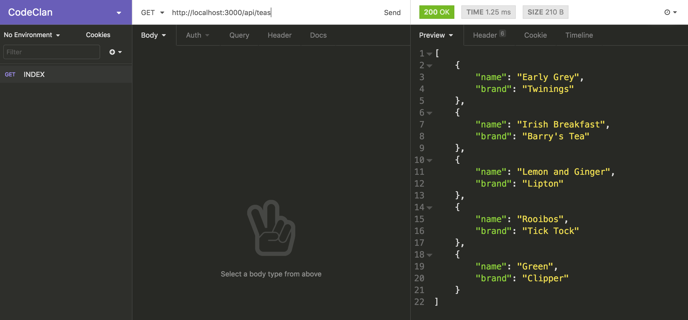
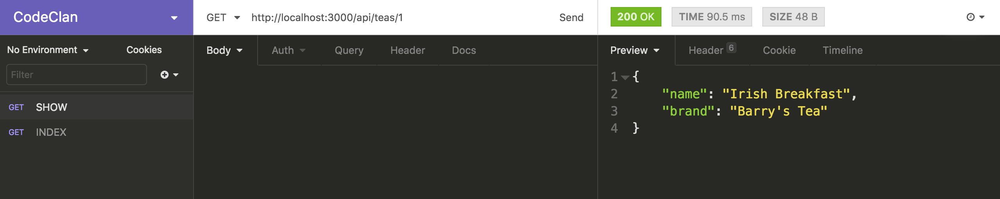
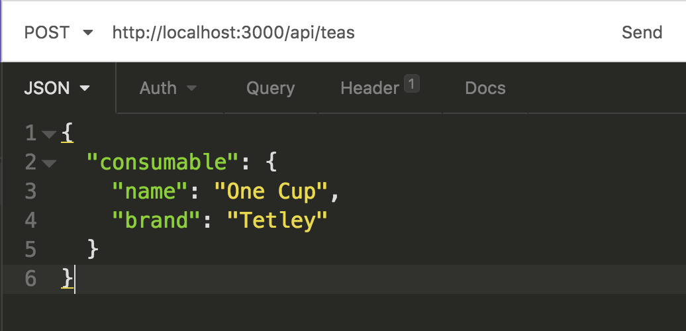
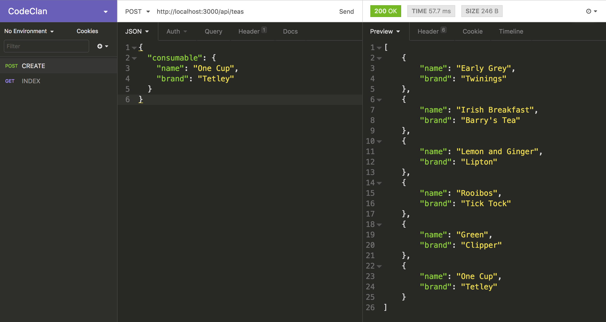
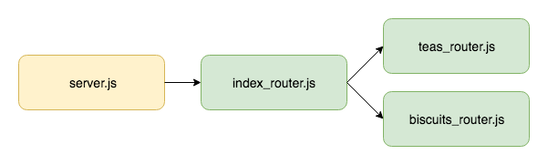

# RESTful API in Express

**Lesson Duration: 2 hours minutes - in bold using asterisks**

### Learning Objectives
- Be able to create a RESTful JSON API with multiple resources
- Be able to use middleware to handle post requests to a RESTful JSON API
- Be able to use Express Router to implement modular routers

## Introduction

A RESTful API defines a set of methods (GET, POST, PUT and DELETE) which developers can use to make requests and receive responses using HTTP protocol. We have been consuming a number of JSON API's that other developers have built. In this lesson we are going to build our own JSON API using an Express server. We will be defining a set of endpoints that handle requests and respond with JSON data, using API design principles to ensure that our service is easy and intuitive for other developers to use.

## RESTful API

When creating an API we want to design it in a way that ensures it is intuitive for other developers to use. To do this we are going to adhere to the following principles:

1. Use the HTTP verbs (GET, POST, PUT and DELETE) appropriately. GET is considered a safe method and shouldn't modify any data.

2. Create endpoints that use the hierarchical nature of the URL to represent the structure of the request. For example, 'https://codeclan.com/students/5' should indicate a request regarding one student from the collection 'students' with id of '5'. Collections should be indicated by a pluralised resource.

Our API will have two resources, teas and biscuits.

## Teas and Biscuits Application

The application has an Express server. Run the start code by running the server and webpack, and visit http://localhost:3000/ in the browser.

### Path

### Task: (5 minutes)

In addition to the 'client' directory, the application also has a 'server' directory, which contains server.js. server.js is responsible for configuring the server. One of these configurations is to provide the path to the directory which it will server up to the browser as static files (in our case the client's 'public' directory). To do this it is using the using Node's `Path` module. Why does it need to use this module?

<details>
<summary>Answer</summary>

Because the public directory is in an adjacent directory, we need to go up a level in the directory hierarchy using `../`. This is a relative path. `express.static` doesn't allow us to pass us a relative path, so we can use `path.join` and `__dirname`, which gives us the current directory, to create an absolute path. This is called path normalisation.

</details>

> Note: The script that starts the server with nodemon also must point to location of server.js with `"server:dev": "nodemon server/server.js"`

### Teas and Biscuits API

The front-end application in the client folder makes two initial requests to the following URLs and displays a list for each set of data it gets back:

1. http://localhost:3000/api/teas
2. http://localhost:3000/api/biscuits

In this lesson we are going to be working entirely server-side to create a RESTful API for this front-end to consume.

## Creating a RESTful API using an Express Server

We want to create a RESTful API that serves up two resources: teas and biscuits. We are going to start by creating the teas resource, adhering to API design principles to create the following endpoints with the corresponding actions:

- `/api/teas` - Index (GET)
- `/api/teas` - Create (POST)
- `/api/teas/:id` - Show (GET)
- `/api/teas/:id` - Update (PUT)
- `/api/teas/:id` - Destroy (DELETE)

> We are using `/api` in the routes to distinguish it from our front-end application. This way, if we wanted a second URL, http://localhost:3000/teas, that served HTML, it wouldn't conflict with the API.

Each of these routes will response with JSON data that our front-end application will consume.

### Index

The start code has an array of teas defined in server.js. Later in the module we will be building API's with data retrieved from a database, but as the focus of this lesson is serving up the JSON data on a set of RESTful routes, we are using hardcoded data.

Let's start by handling a GET request to the index (`/`). We will use Express's `get` method, passing it the path and a callback that gets passed a request (`req`) and response (`res`) object. We will then send back the `teas` array as JSON using the response object's `json` method.

```js
// server.js

const teas = [
  //...
];

router.get('/api/teas', (req, res) => { // NEW
  res.json(teas);
});
```

Now when we visit http://localhost:3000/api/teas in the browser, we see the JSON teas data displaying. We have just made the first endpoint of our API.

### Insomnia

When we are building an API, we want a way of testing the endpoints as we create them. We can test the GET methods (index and show) in the browser, but we need a way of testing the other HTTP methods such as POST (create) and PUT (update) without having to build a front-end with a form to send the data. [Insomnia REST Client](https://insomnia.rest/) is a HTTP client that provides us with an convenient way to test all the HTTP methods without requiring a front-end.

We are going to use Insomnia REST Client to the index route we have just created.

1. Open Insomnia REST Client.
2. Click the `+` symbol in the left menu (or use `cmd` + `N`) to create a new request.
3. Enter a name ('Index') and select the method ('GET') for the request. Click 'Create'.
4. Add the URL (http://localhost:3000/api/teas) in the address bar at the top.
5. Click 'Send' to see the response data display in the right-pane.



*GET request to 'http://localhost:3000/api/teas' displaying the response using Insomnia REST Client*

### Show

Let's now implement the show action, where we respond to the request with one object. The request URL will contain a parameter, which we use to identify which object is being requested. For example, 'http://localhost:3000/api/teas/1', where '1' relates to the id of the tea being requested.

Again, it will be a GET request, so we will use the `get` method, passing it the path. This time the path will include a parameter (indicated by the colon proceeding it). We will call the parameter `id`. Often we would be working with ids assigned by a database as we can ensure these are unique, but in this case we will use the index position of the tea object in the array.

```js
router.get('/api/teas', (req, res) => {
  res.json(teas);
});

router.get('/api/teas/:id', (req, res) => { // NEW

});

```

On the request object, we can access the `params` (short for parameters) object. This allows us to use the parameter `id` to get back the value sent as part of the url. We can use that number to select the tea with that index position from the array and send it back on the response as JSON.

```js
router.get('/api/teas/:id', (req, res) => {
  res.json(teas[req.params.id]); // MODIFIED
});

```

Let's test our show route in Insomnia:

1. Click the `+` symbol in the left menu (or use `cmd` + `N`) to create a new request.
2. Enter a name ('Show') and select the method ('GET') for the request. Click 'Create'.
3. Add the URL (http://localhost:3000/api/teas/1) in the address bar at the top.
4. Click 'Send' to see the response data display in the right-pane.



*GET request to 'http://localhost:3000/api/teas/1' displaying the tea object at position 1 in the array using Insomnia REST Client*

### Create

To be able to handle a POST request, we have to learn about the request's body object. When the client makes a POST request it can send data with the body of the request (for example, the values of a form when it is submitted), which we can then retrieve server-side.

In our case we want the client to be able to send a tea object on the request, and to then add that object to the `teas` array. Our POST route is going to expect to receive an object with the key `consumable` (a generic name for teas and biscuits) with the value of the tea object with a `name` and `brand`.

```js
{
  consumable: {
    name: One Cup,
    brand: Tetley
  }
}
```

We will use Express's `post` method, pass it the appropriate path, '/api/teas' and a callback. To access the data sent from the client with the request, we access the request's `body` object, and the key on which we are expecting the data to be sent (`consumables`).

```js
router.get('/api/teas/:id', (req, res) => {
  res.json(teas[req.params.id]);
});

router.post('/api/teas', (req, res) => { // NEW
  console.log(req.body.consumable);
});
```

Test our create route in insomnia:

1. Click the `+` symbol in the left menu (or use `cmd` + `N`) to create a new request.
2. Enter a name ('Create') and select the method ('POST') for the request. Click 'Create'.
3. Add the URL (http://localhost:3000/api/teas) in the address bar at the top.
4. This time we need to add the data we want to send with the request. Click 'Body', select 'JSON' and the add the following JSON to the left-hand pane.

```js
{
  "consumable": {
    "name": "One Cup",
    "brand": "Tetley"
  }
}
```



*Adding the JSON body to a POST request in Insomnia Rest Client*

> Note: The keys must be enclosed with inverted commas because this is JSON (not JavaScript)

When we click send we get a TypeError. To fix this error we need to use some Express middleware.

### body-parser

We get a TypeError 'Cannot read property 'consumable' of undefined' telling us that `body`, which we are trying to access on the request object, is undefined. Express is a light-weight framework and it doesn't expose the body object with its built-in functionality. To access the request's body we have to use some middleware called `bodyParser`. The role of body-parser is to extract the body from the POST request and make it accessible on `req.body`.

body-parser is an npm package so first we need to install it.

```bash
npm install body-parser
```
Then we require it and tell the server to use it.

```js
const path = require('path');
const bodyParser = require('body-parser'); // NEW

const publicPath = path.join(__dirname, '../client/public');
app.use(express.static(publicPath));

app.use(bodyParser.json()); // NEW
```

`bodyParser.json()` provides the middleware that parses json, so our API will only parse the body of a request which has a header with 'Content-Type' specified as JSON. If you click on the 'Header' tab of the left hand section of Insonia, you will see that there has been a header set with 'Content-type' set to 'application/json'. Insonmia does this for us when we add a JSON body to the request.

Now when we test our create route, Insomnia Rest Client will hang because we haven't told it what to do in response to the request, but if you look in the terminal window where the server is running, you will see the data outputted: `{ name: 'One Cup', brand: 'Tetley' }`.

To complete the request, let's push the posted data into the array of teas and send back the updated array.

```js
router.post('/api/teas/', (req, res) => {
  teas.push(req.body.consumable);
  res.json(teas);
});
```

Now when we test the POST request in Insomnia REST Client, you should get a response of the teas data, with the new tea added.



*POST request to 'http://localhost:3000/api/teas' displaying the response using Insomnia REST Client*

Our create route is now complete.

### Task (15 minutes)

Implement the following routes where the parameter `id` refers to tea's index position in the array.

`/api/teas/:id` - Update (PUT)
`/api/teas/:id` - Destroy (DELETE)

Test each of the routes with Insomnia

<details>
<summary>Example solution</summary>

```js
// server.js

// ...

app.put('/api/teas/:id', (req, res) => {
  teas[req.params.id] = req.body.consumable;
  res.json(teas);
});

app.delete('/api/teas/:id', (req, res) => {
  teas.splice(req.params.id, 1);
  res.json(teas);
});
```

</details>

We now have the CRUD (Create, Read, Update and Delete) operations for our teas resource.

## Express Router

If we now want to add the second resource (biscuits) with all the corresponding routes, our server.js is going to get pretty unmanageable. As additional resources get added, the file will get increasingly difficult to maintain. Express provides a Router object which allows us to modularise our sets of routes, specifying a particular path ('/api/teas' and '/api/biscuits') for each router.

We are going to refactor our back-end to implement modular routers and add the additional biscuits resource. The server will use an index router, which will be responsible for using the various resources' routers. This is what our back-end architecture is going to look like:



*Server-side architecture with modular routers*

Let's create a `routers` directory in the root directory to keep all the routers together:

```bash
mkdir routers
```
We will start by creating:

1. index_router.js that will be the link between server.js and the individual resource routers.
2. teas_routers.js that will be responsible for handling the teas resource routes.

```bash
touch routers/index_router.js
touch routers/teas_router.js
```

### Teas Router

Let's start by creating the teas router. It will create and export an Express `Router`. We will require Express and invoke `Router` which returns a `Router` object.

```js
// teas_router.js

const express = require('express');
const router = express.Router();

module.exports = router;
```

Let's now move the teas data and the routes handling the teas resource requests, from server.js into teas_router.js. (Delete it from server.js and add it into teas_router.js).

```js
const express = require('express');
const router = express.Router();

const teas = [ // NEW
  { name: "Early Grey", brand: "Twinings" },
  { name: "Irish Breakfast", brand: "Barry's Tea" },
  { name: "Lemon and Ginger", brand: "Lipton" },
  { name: "Rooibos", brand: "Tick Tock" },
  { name: "Green", brand: "Clipper" }
];

app.get('/api/teas/', (req, res) => {
  res.json(teas);
});

app.get('/api/teas/:id', (req, res) => {
  res.json(teas[req.params.id]);
});

app.post('/api/teas/', (req, res) => {
  teas.push(req.body.consumable);
  res.json(teas);
});

app.put('/api/teas/:id', (req, res) => {
  teas[req.params.id] = req.body.consumable;
  res.json(teas);
});

app.delete('/api/teas/:id', (req, res) => {
  teas.splice(req.params.id, 1);
  res.json(teas);
});

module.exports = router;
```

We need to make a couple of changes the routes we brought in:

1. We need to call the methods on the router object, `router`, rather than `app`
2. We need to remove `/api/teas` from the paths, as this will be specified by the index router

```js
const express = require('express');
const router = express.Router();

const teas = [
  { name: "Early Grey", brand: "Twinings" },
  { name: "Irish Breakfast", brand: "Barry's Tea" },
  { name: "Lemon and Ginger", brand: "Lipton" },
  { name: "Rooibos", brand: "Tick Tock" },
  { name: "Green", brand: "Clipper" }
];

router.get('/', (req, res) => { // MODIFIED
  res.json(teas);
});

router.get('/:id', (req, res) => { // MODIFIED
  res.json(teas[req.params.id]);
});

router.post('/', (req, res) => { // MODIFIED
  teas.push(req.body.consumable);
  res.json(teas);
});

router.put('/:id', (req, res) => { // MODIFIED
  teas[req.params.id] = req.body.consumable;
  res.json(teas);
});

router.delete('/:id', (req, res) => { // MODIFIED
  teas.splice(req.params.id, 1);
  res.json(teas);
});

module.exports = router;
```

That is our teas router complete.

### Index Router

Next we are going to create the index router. It is also a router, so it will create and export a `Router` object.

```js
// index_router.js

const express = require('express');
const router = express.Router();

module.exports = router;
```

The index router is going to be responsible for linking the server.js to the individual routers.
We will require teas_router.js and tell the index router to use the teas router. When we call the `use` method, we pass it the path that we want it to use the teas router on, (this is why we removed `/api/teas` from the teas router routes), meaning we only have to state it here in index_router.js once.

```js
const express = require('express');
const router = express.Router();
const teasRouter = require('./teas_router.js'); // NEW

router.use('/api/teas', teasRouter); // New

module.exports = router;
```

Now we are set up nicely for when we want to add additional resources, as we will be able to create additional modular routers for each resource and require and add them here.

### Server

We want server.js to be responsible for configuration only. Therefore we have abstracted the responsibility for creating the routers to the index router. We now we need to tell the server to use the index router.

Let's require index_router.js in server.js, and tell the server to use it.

```js
// ...

const bodyParser = require('body-parser');
const indexRouter = require('./routers/index_router.js'); // NEW

const publicPath = path.join(__dirname, '../client/public');
app.use(express.static(publicPath));

app.use(bodyParser.json());
app.use(indexRouter); //NEW

// ...

```

Lastly, we can delete the following lines from server.js, as Express will look for a file called index.html in the folder we serve as static files (in our case, the 'public' directory) and send it back in response to a GET request made to the home route.

```js
app.get('/', (req, res) => {
  res.sendFile('index.html');
});
```

Great, now you can test your API in Insomnia Rest Client again to ensure it is still serving the JSON on the endpoints and visit http://localhost:3000/ to ensure the index.html is still being served up on the home route.

### Task (10 minutes)

Create a biscuits resource with the following endpoints and corresponding actions:

- `/api/teas` - Index (GET)
- `/api/teas` - Create (POST)
- `/api/teas/:id` - Show (GET)
- `/api/teas/:id` - Update (PUT)
- `/api/teas/:id` - Destroy (DELETE)

The resource should serve up the following seed data:

```js
const biscuits = [
  { name: "Digestives", brand: "McVitie's" },
  { name: "Hobnobs", brand: "McVitie's" },
  { name: "Shortbreads", brand: "Walkers" },
  { name: "Jammy Dodgers", brand: "Burton's" },
  { name: "Custard Creams", brand: "Crawford's" }
];
```

<details>
<summary>Example solution</summary>

```js
// index_router.js

const express = require('express');
const router = express.Router();
const teasRouter = require('./teas_router.js');
const biscuitsRouter = require('./biscuits_router.js'); // NEW

router.use('/api/teas', teasRouter);
router.use('/api/biscuits', biscuitsRouter); // NEW
```

```js
// biscuits_router.js

const express = require('express');
const router = express.Router();

const biscuits = [
  { name: "Digestives", brand: "McVitie's" },
  { name: "Hobnobs", brand: "McVitie's" },
  { name: "Shortbreads", brand: "Walkers" },
  { name: "Jammy Dodgers", brand: "Burton's" },
  { name: "Custard Creams", brand: "Crawford's" }
];

router.get('/', (req, res) => {
  res.json(biscuits);
});

router.get('/:id', (req, res) => {
  res.json(biscuits[req.params.id]);
});

router.post('/', (req, res) => {
  biscuits.push(req.body.consumable);
  res.json(biscuits);
});

router.put('/:id', (req, res) => {
  biscuits[req.params.id] = req.body.consumable;
  res.json(biscuits);
});

router.delete('/:id', (req, res) => {
  biscuits.splice(req.params.id, 1);
  res.json(biscuits);
});

module.exports = router;
```
</details>

Because the front-end is set up to consume the API on these routes, if you visit 'http://localhost:3000/' you are now able to use the form to submit a tea or a biscuit and see it render to the screen.

### Task (15 minutes)

Take note of how the front-end application handles the submission of the form, from the point the form is submitted, to the updated list being rendered on the screen.

<details>
<summary>Example solution</summary>

1. When the form is submitted, `FormView` creates an object using the submitted values with the key `consumable`. It publishes this object on the channel `FormView:submit-${category}` where category is either teas or biscuits.

2. The relevant `Consumable` object is subscribed to this channel. When it receives the data it uses the `Request` helper's `post` method to post the data to the API.

3. The `Request` helper's `post` method (like its `get` method) uses `fetch`, but passes it an object as a second optional argument, that specifies three properties:
- the method - POST
- the body - the submitted form data as JSON
- the data type being sent - JSON

4. On completion of the post method, the `Consumable` object receives the updated list from the API as the response and publishes it on the channel, `Consumables:${this.category}-data-loaded`.

5. The relevant `ListView` is subscribed to this channel, and when it receives the data it rerenders the list with the new data.

</details>

## Recap

What design principles should we consider when creating and API? And why?

<details>
<summary>Answer</summary>

We should use the appropriate HTTP methods and create endpoints that use hierarchical nature of the URL to represent the structure of the request, so that it is easy and intuitive to use.

</details>

What is the function of the the Express middleware, body-parser?

<details>
<summary>Answer</summary>

The role of body-parser is to extract the body from the incoming POST request and make it accessible on `req.body`.

</details>

What problem does the Express Router object solve?

<details>
<summary>Answer</summary>

It prevents all our routes for multiple resources having to be in one place. It allows us to create modularised routers.

</details>

</details>

What is the role of the index router?

<details>
<summary>Answer</summary>

To set up the routing for all individual resource routers and any additional routes. It is the bridge between the server and the individual routers and enables the server to be solely responsible for configuration.

</details>

## Conclusion

Creating RESTful APIs allows us to create a back-end service that our front-end application can consume. Adhering to RESTful API design principles we can ensure our APIs are easy and intuitive for other developers to use.

Because Express is a light-weight framework, we have to use the additional middleware, body-parse, to handle POST requests and retrieve the data sent on the body of the request.

Using Express Router we can create modularised routes for each of the API's resources, creating a server-side application which is maintainable and extensible.
